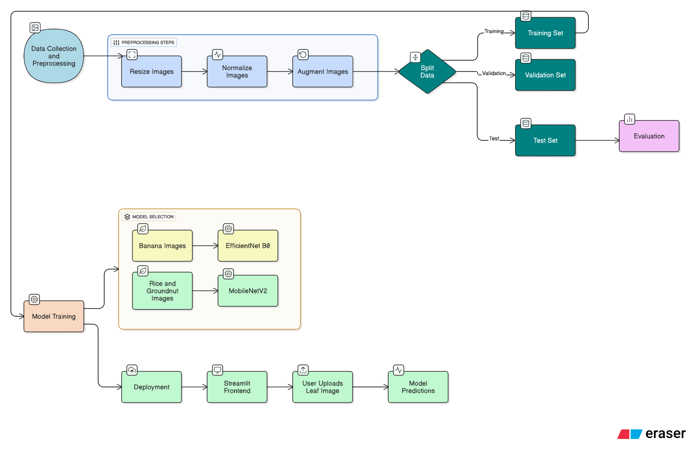
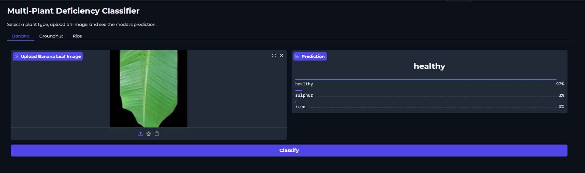
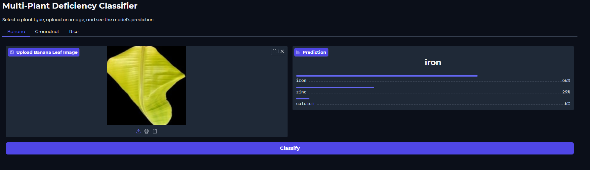
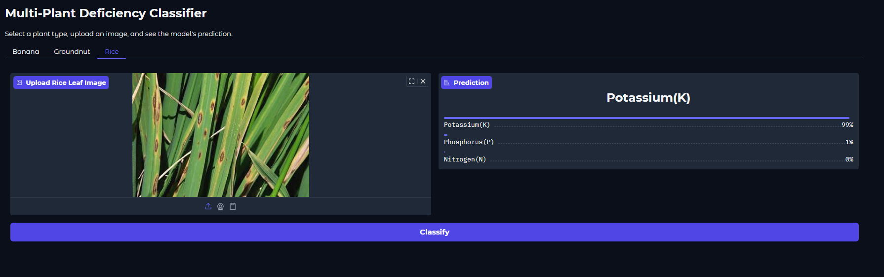

# Leaf Nutrient Deficiency Classifier  

A deep learning–based system to **detect and classify nutrient deficiencies in crop leaves**.  
This project uses **Convolutional Neural Networks (CNNs)** to analyze leaf images and identify whether a leaf is **healthy** or shows signs of **nutrient deficiency**, with crop-specific models trained on **Rice, Banana, and Groundnut**.  

---

## Project Overview  
- **Datasets** collected from agricultural research papers for three crops.  
- **CNN models** trained using **PyTorch**:  
  - **Banana** → EfficientNet-B0  
  - **Rice** → MobileNetV2  
  - **Groundnut** → MobileNetV2  
- Built a simple **Streamlit frontend** for farmer-friendly usability.  

---

## Model Architecture  
We experimented with lightweight CNN architectures suitable for agricultural use cases:  

| Crop       | Model         | Reason for Choice |
|------------|--------------|------------------|
| Banana     | EfficientNetB0 | Balances accuracy and efficiency |
| Rice       | MobileNetV2    | Lightweight and effective on leaf datasets |
| Groundnut  | MobileNetV2    | Consistent results with small datasets |  

<p align="center">
    
</p>  

---

## Methodology  

### 1. Data Collection & Preprocessing  
- Collected crop leaf images from agricultural research datasets.  
- Applied preprocessing: **resizing (224×224), normalization**, and **augmentation** (rotation, flips, zoom).  
- Split into **train, validation, and test sets** for fair evaluation.  

### 2. Model Training  
- Framework: **PyTorch**  
- **Banana** → EfficientNet-B0  
- **Rice & Groundnut** → MobileNetV2  
- Transfer learning with pretrained ImageNet weights.  
- Optimizer: Adam, with learning rate scheduler.  
- Loss function: CrossEntropyLoss 
- Implemented Early Stopping to prevent overfitting.  

### 3. Evaluation  
- Evaluated on unseen test datasets.  
- Metrics: Accuracy, Precision, Recall, F1-score.  

### 4. Deployment  
- Built a Streamlit frontend.  
- Users can upload a leaf image → Model predicts crop health & deficiency type in real time.  


---

##  Results  
| Crop       | Model         | Accuracy (Test) |
|------------|--------------|-----------------|
| Banana     | EfficientNetB0 | 83.10% |
| Rice       | MobileNetV2    | 91.12% |
| Groundnut  | MobileNetV2    | 96.49% |   

---

## Streamlit Frontend  
We developed a simple **Streamlit app** for user interaction:  
- Upload a leaf image.  
- The model predicts **Healthy** / **Deficient**.  
- If deficient → predicts the **type of nutrient deficiency**.  

<p align="center">
    
</p>  

<p align="center">
    
</p>  

<p align="center">
    
</p>  

---

## Future Work  
- Extend to more crops beyond Rice, Banana, and Groundnut.  
- Build a mobile-friendly app for field deployment.  
- Improve model robustness with larger datasets.  

---

## Tech Stack  
- **Deep Learning**: PyTorch  
- **Models**: EfficientNetB0, MobileNetV2  
- **Frontend**: Streamlit  
- **Visualization**: Matplotlib, Seaborn  

---

## How to Run  

```bash
# Clone the repository
git clone https://github.com/yourusername/leaf-nutrient-deficiency-classifier.git
cd leaf-nutrient-deficiency-classifier

# Install dependencies
pip install -r requirements.txt

# Run Streamlit app
streamlit run app.py
```

