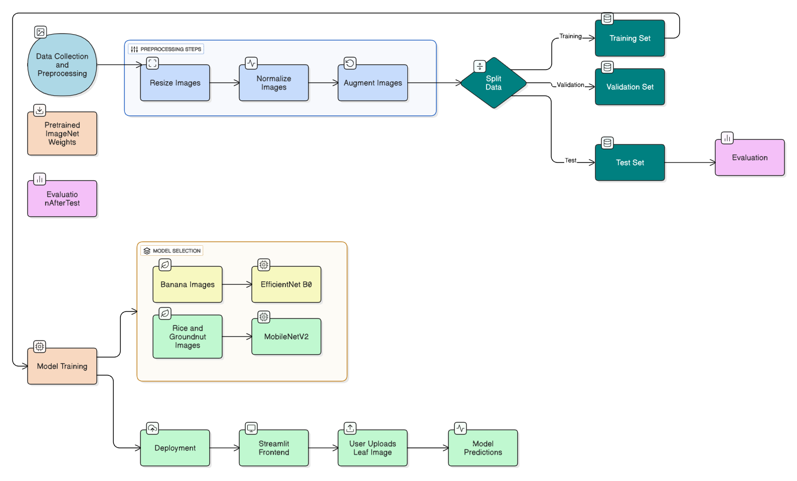

# Leaf Nutrient Deficiency Classifier  

A deep learning–based system to **detect and classify nutrient deficiencies in crop leaves**.  
This project uses **Convolutional Neural Networks (CNNs)** to analyze leaf images and identify whether a leaf is **healthy** or shows signs of **nutrient deficiency**, with crop-specific models trained on **Rice, Banana, and Groundnut**.  

---

## Project Overview  
- **Datasets** collected from agricultural research papers and curated for three crops.  
- **CNN models** trained using **PyTorch**:  
  - **Banana** → EfficientNet-B0  
  - **Rice** → MobileNetV2  
  - **Groundnut** → MobileNetV2  
- Built a simple **Streamlit frontend** for farmer-friendly usability.  

---

## Dataset  
- Data was collected from published **research papers**.  
- [🔗 Dataset Link Placeholder – Add yours here]  
- Example images:  

<p align="center">
    
    
    
</p>  

---

## Model Architecture  
We experimented with lightweight CNN architectures suitable for agricultural use cases:  

| Crop       | Model         | Reason for Choice |
|------------|--------------|------------------|
| Banana     | EfficientNetB0 | Balances accuracy and efficiency |
| Rice       | MobileNetV2    | Lightweight and effective on leaf datasets |
| Groundnut  | MobileNetV2    | Consistent results with small datasets |  

<p align="center">
    
</p>  

---

## ⚙️ Methodology  
1. **Data Collection & Preprocessing**  
   - Extracted images from agricultural research papers.  
   - Resized and augmented for training robustness.  

2. **Model Training**  
   - Framework: **PyTorch**  
   - Optimizers & schedulers tuned for each crop.  
   - Early stopping applied to avoid overfitting.  

3. **Evaluation**  
   - Evaluated on unseen **test datasets**.  
   - Metrics: Accuracy, Precision, Recall, F1-score.  

4. **Deployment**  
   - Streamlit-based frontend for user interaction.  
   - Upload a leaf image → Model predicts crop health & deficiency.  

---

## 📊 Results  
| Crop       | Model         | Accuracy (Test) |
|------------|--------------|-----------------|
| Banana     | EfficientNetB0 | XX% |
| Rice       | MobileNetV2    | XX% |
| Groundnut  | MobileNetV2    | XX% |  

<p align="center">
    
</p>  

---

## Streamlit Frontend  
We developed a simple **Streamlit app** for user interaction:  
- Upload a leaf image.  
- The model predicts **Healthy** / **Deficient**.  
- If deficient → predicts the **type of nutrient deficiency**.  

<p align="center">
    
</p>  

---

## Future Work  
- Extend to more crops beyond Rice, Banana, and Groundnut.  
- Build a **mobile-friendly app** for field deployment.  
- Improve model robustness with larger datasets.  

---

## Tech Stack  
- **Deep Learning**: PyTorch  
- **Models**: EfficientNetB0, MobileNetV2  
- **Frontend**: Streamlit  
- **Visualization**: Matplotlib, Seaborn  

---

## How to Run  

```bash
# Clone the repository
git clone https://github.com/yourusername/leaf-nutrient-deficiency-classifier.git
cd leaf-nutrient-deficiency-classifier

# Install dependencies
pip install -r requirements.txt

# Run Streamlit app
streamlit run app.py
```

